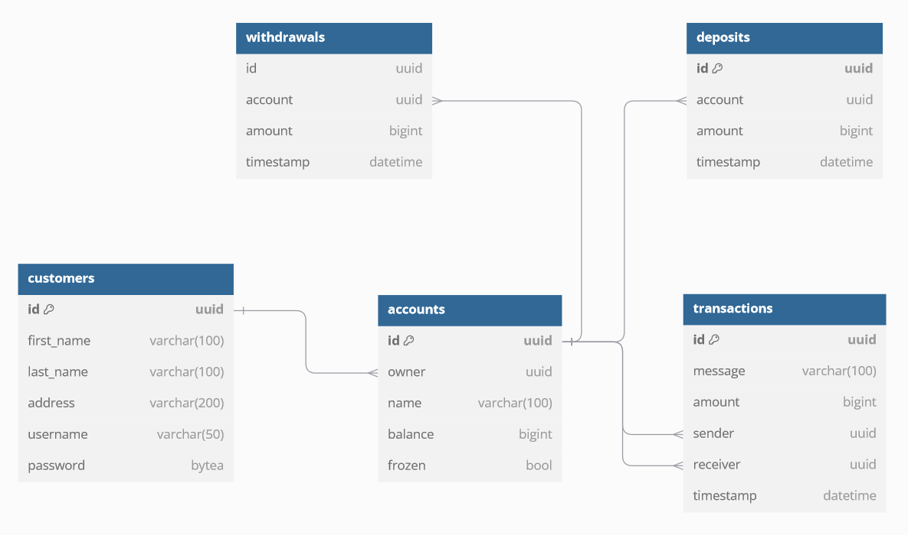
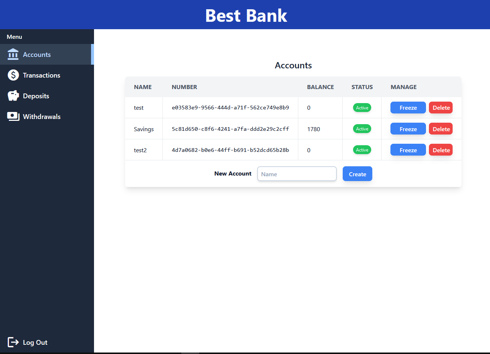
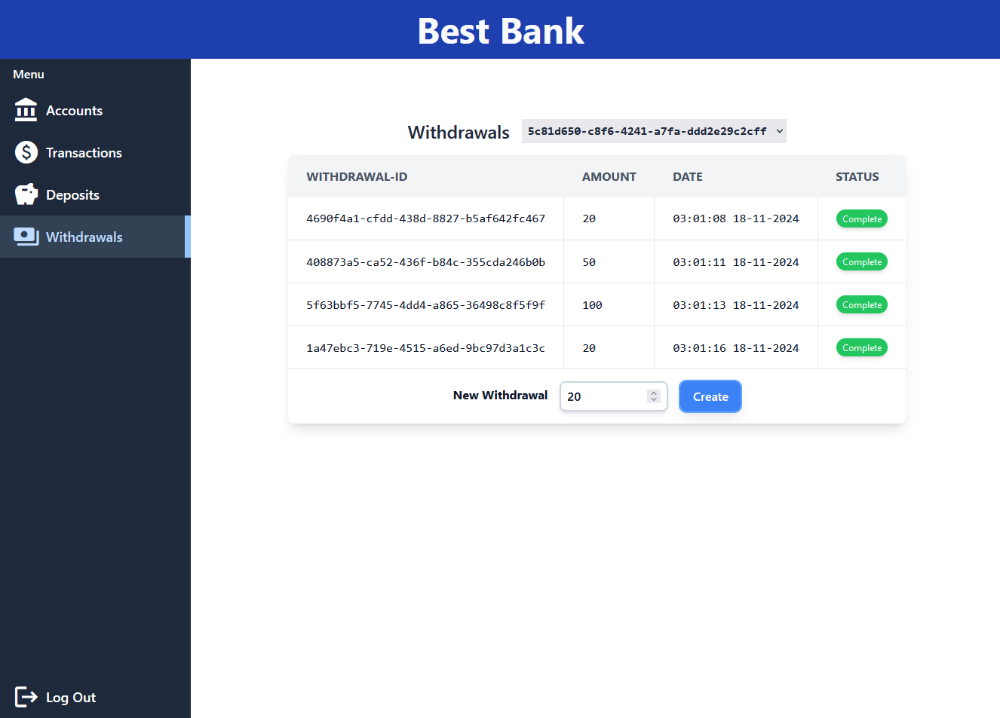

An example of a banking web app using a Vue.js frontend and a Quarkus backend.
This app was mainly tested on Firefox with a 1920x1080 Monitor.

Features:
- Login
- Accounts management
- Transactions
- Deposits/Withdrawals

Technologies used:
- Docker
- Java + Quarkus Framework
- Quarkus Hibernate + Panache
- Quarkus Jackson REST
- Vue.js
- Tailwind CSS
- nginx
- PostgreSQL

IMPORTANT:
- This is just an example and has some obvious security flaws that should not exist in a production setting!!!

Installation:

1. clone repository

2. cd BankingApplication/Backend/banking-server

3. mvn package

4. docker compose build

5. docker compose up -d

-> Website is deployed on http://localhost:80

Images:

Database Schema:

Accounts Page:

Withdrawals Page:

